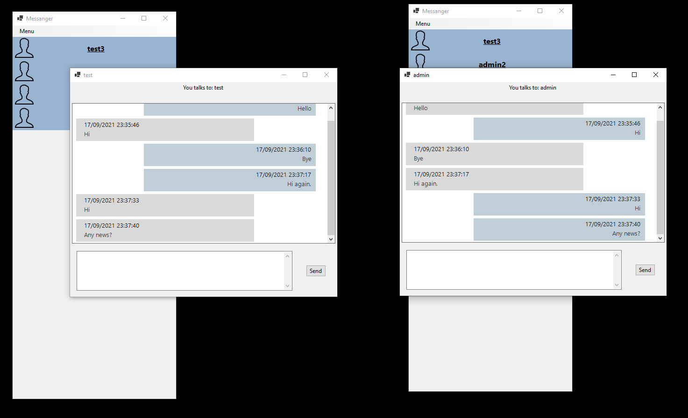
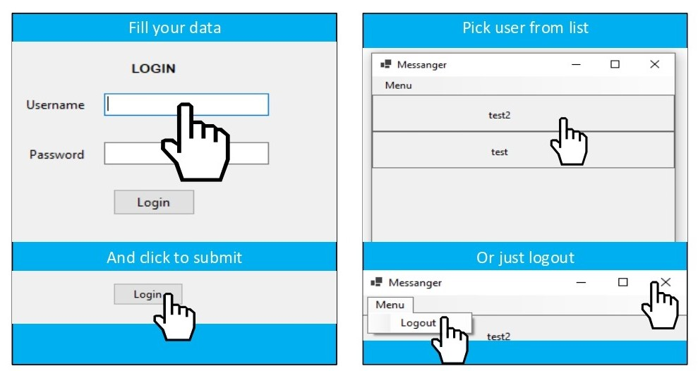
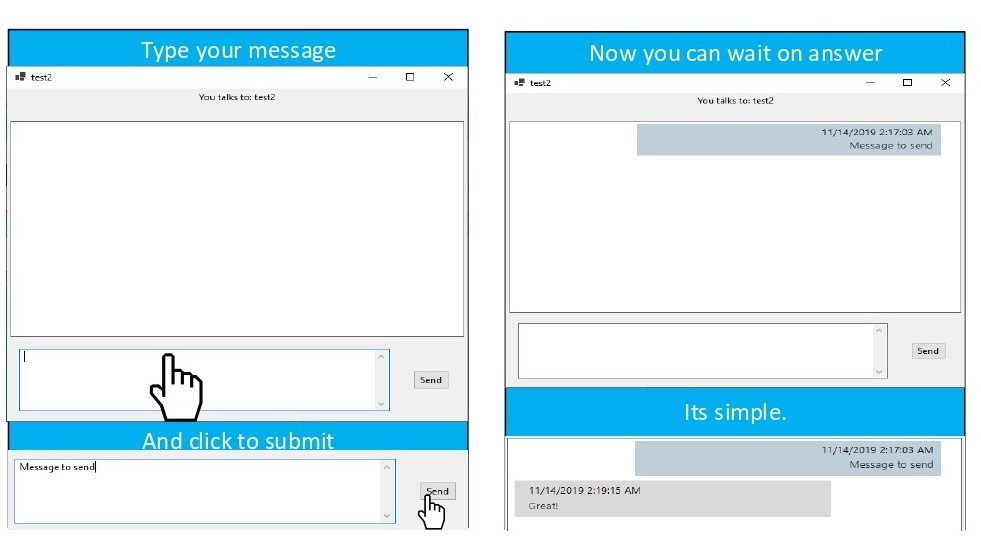
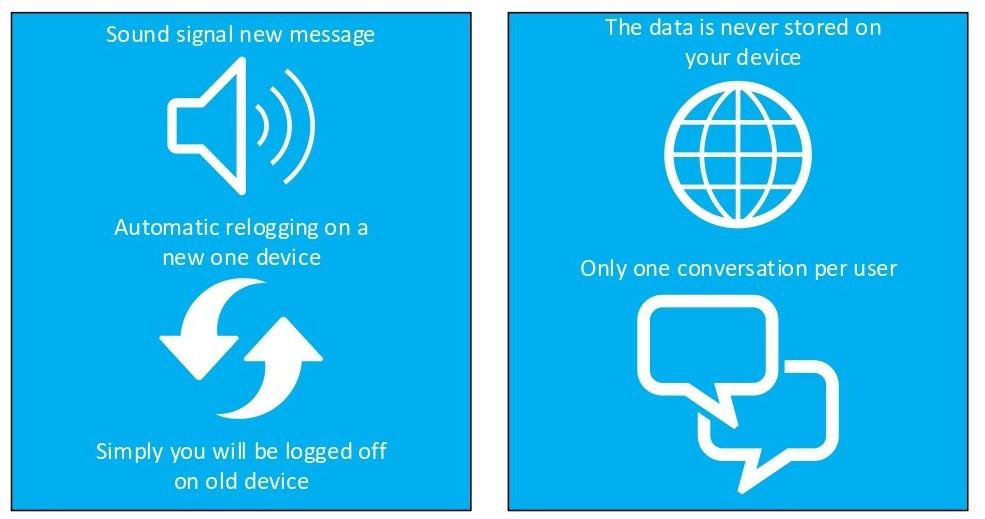

# Desktop Messenger Application
server and client application build using .NET CORE and SignalR

### Scope
The project is to create an application for DOGE FINANCIAL, used for communication 
between company users. The program is to be characterized by a high standard of security, as the data transmitted is sensitive and requires special treatment and protection against third parties. Also, the program is to send data between users as soon as possible - in real time. The only place to store data is to be the database that is hosted on the company's server. Only verified employees can use the program, they will can access with the appropriate login and password. 

### Security 
- Password encryption 
- Message encryption 
- Tokens
- Session
- Hold data in client memory 

### Patterns
- Dependency injection 
- MVC/MVP 
- Repository pattern + Entity Framework 
- Singleton
- Real-Time 
- Application Layers 

## Specific requirements
### Functional requirements
- Login to the application
- Sending messages 
- Receiving messages 
- Starting a conversation 
- Viewing the user list 
- Message encryption 
- Minimal latency 
- Microsoft Windows 7 compatibility 
- Copy of messages 
- Message sound 
- Remove old messages 
 ### Non-functional requirements 
- Offloading the database 
- Connection security 
- Professional application template 
- User management 
- Work in a remote network 
- Preventing multi-logging 
- Session

